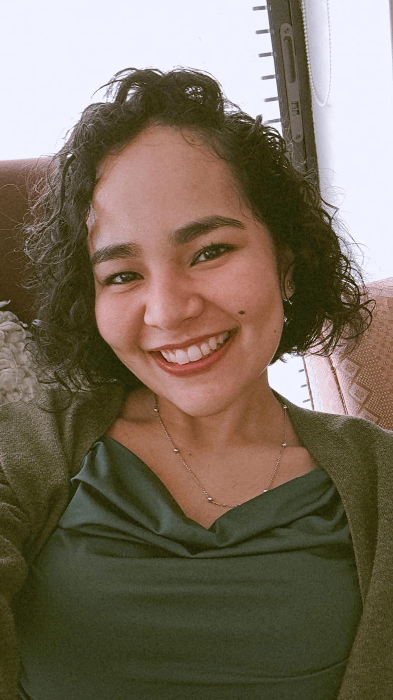
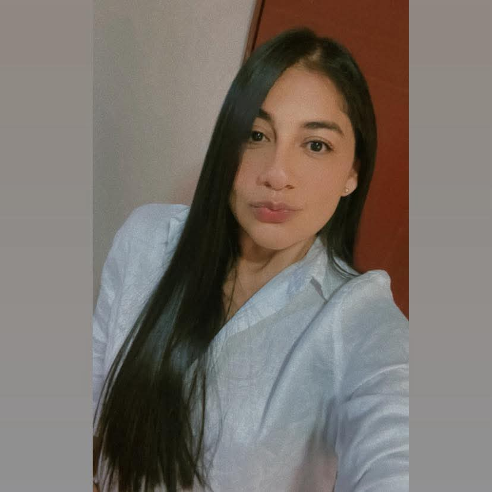
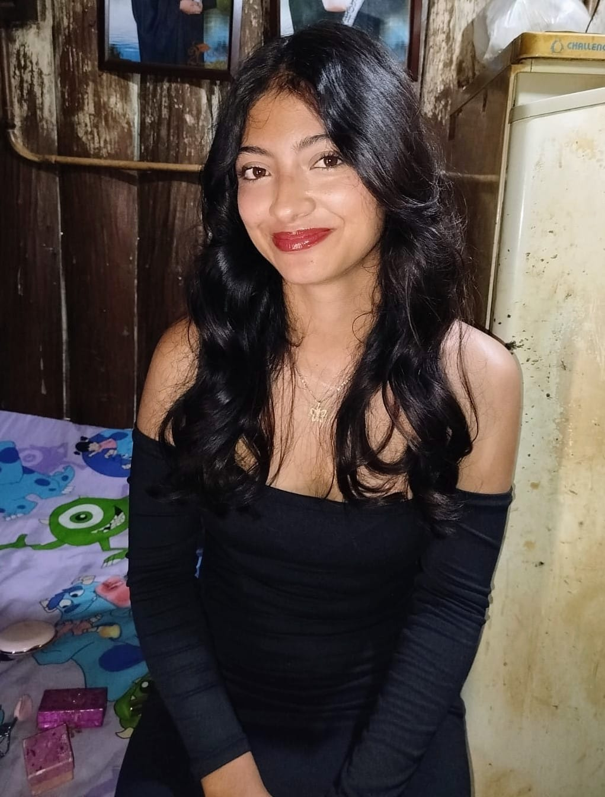

# 5 águilas ágiles

## Sayuri Ecima Castillo

**Rol en la industria:** Game Programmer  

**Ubicación:** Ibagué  

**Perfil Breve:**  
Estudiante de ingeniería multimedia de sexto semestre. Hago parte del CEAD Ibagué.  

## Dayana Gutierrez  

**Rol en la industria:** Diseñador de sonido  

**Ubicación:** Neiva

**Perfil Breve:**
Estudiante de décimo semestre de ingeniería multimedia. Hago parte del CCAV Neiva.

## Paula Andrea Zambrano Meneses  

**Rol en la industria:** Diseñadora Multimedia  

**Ubicación:** Líbano - Tolima  

**Perfil Breve:**  
Estudiante de Ingeniería Multimedia de sexto semestre, pertenezco a la UDR Líbano Tolima.

## Oscar Eduardo Losada Tocora

**Rol en la industria:** Producer / Scrum Master

**Ubicación:** La Plata - Huila

**Perfil Breve:** 
Estudiante de noveno semestre de Ingeniería multimedia. Pertenezco a la sede UDR-La Plata, Huila 
